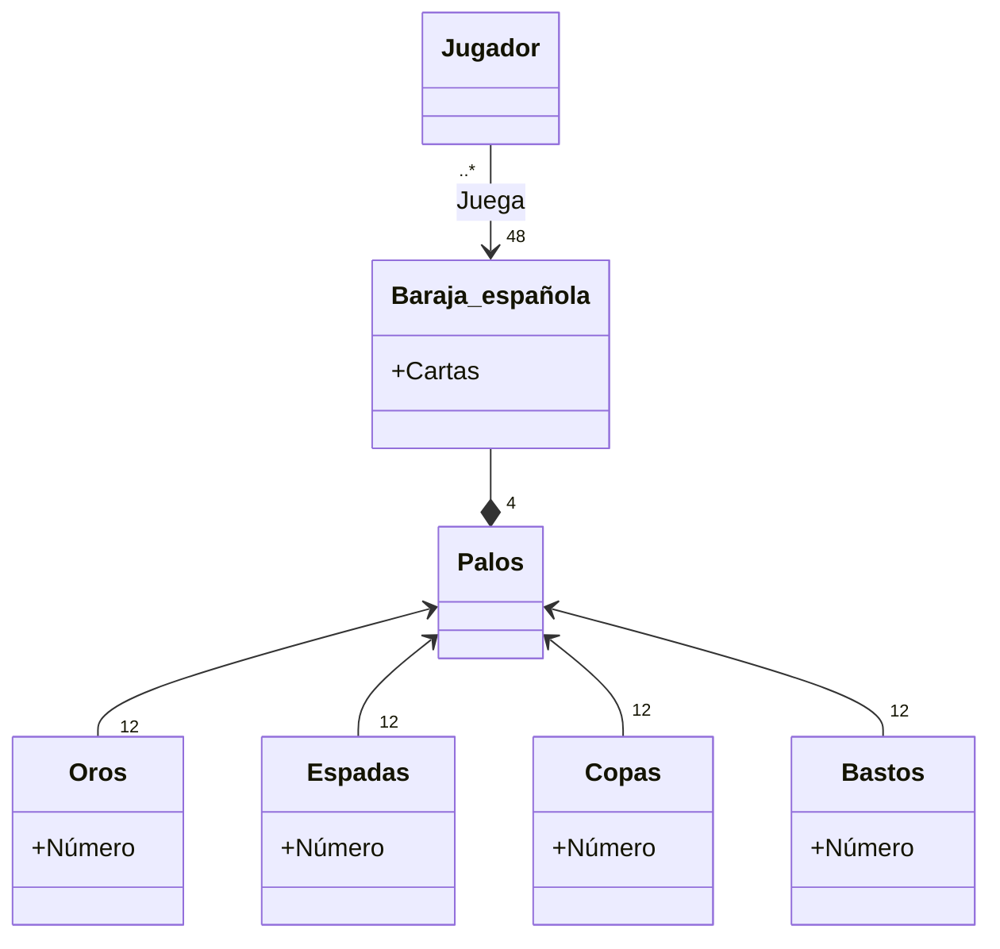

# Mermaid playing "Baraja Española"
I used to play this game a lot with my mom's uncle, so it brougth me good memories about my childhood.
***

```mermaid
classDiagram
    class Jugador {
    }
    class Baraja_española {
        +Cartas
    }
    class Palos {
    }
    class Oros {
        +Número
    }
    class Espadas {
        +Número
    }
    class Copas {
        +Número
    }
    class Bastos {
        +Número
    }

    Jugador "..*" --> "48" Baraja_española : Juega
    Baraja_española --* "4" Palos
    Palos <-- "12" Oros
    Palos <-- "12" Espadas
    Palos <-- "12" Copas
    Palos <-- "12" Bastos
```
